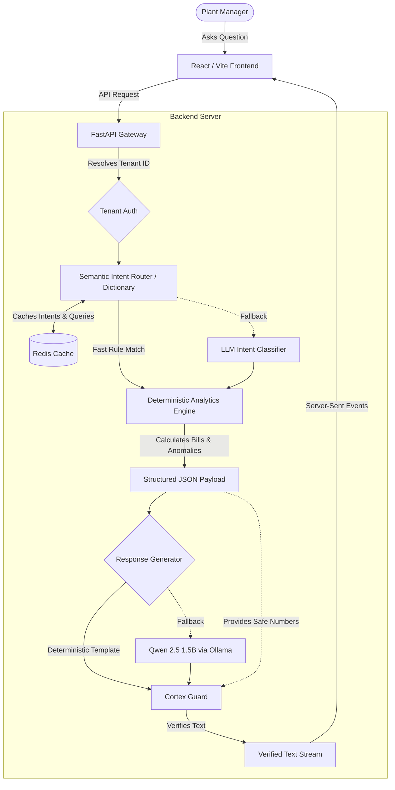

# System Architecture

Here is a look under the hood at how Cortex Copilot actually works. 

My main goal was to completely eliminate LLM hallucinations while maintaining strict tenant data isolation. To do this, I decided not to let the LLM do any math or data processing itself. Instead, the heavy lifting is done by a deterministic Python engine, and the LLM is just used as a translation layer to explain the numbers to the user.

## Architecture Diagram

## How the Components Work Together

### 1. The Frontend (React + Vite)
This is the user-facing dashboard. It handles tenant logins, displays the proactive "Insights Panel" (which is populated directly by the analytics engine), and manages the chat interface using Server-Sent Events (SSE) so the text streams in smoothly just like ChatGPT.

### 2. The Gateway (FastAPI)
The backend gateway handles all authentication. Before any data is processed, it grabs the authenticated user's `tenant_id` and strictly scopes all database and analytics queries to that specific ID. This makes cross-tenant data leaks practically impossible at the routing level.

### 3. Caching Layer (Redis)
To minimize latency and reduce redundant computations, a Redis cache sits alongside the router and authentication layer. It actively caches complex user queries, mapped intents, and tenant metadata. If a user asks a similar question twice, Redis serves the exact tool routing instantly, bypassing the need for string parsing or LLM classification.

### 4. Semantic Intent Router (The Dictionary)
Before hitting the heavy Analytics Engine, the user's query passes through a highly optimized rules dictionary (`router_config.json`). It looks for specific keywords (like "thd", "bill", "power factor") and semantic triggers to instantly decide which analysis tool to run. If the user's query doesn't match any known dictionary rules, it safely falls back to a fast LLM intent classification prompt.

### 5. The Analytics Engine (Python)
This is where the actual math happens. It takes the raw 15-minute telemetry intervals (active energy, apparent energy, phase voltages, THD) and runs hardcoded engineering formulas on it. It calculates maximum rolling demand, average power factor, checks ToD (Time of Day) peak usage, and flags IEEE-519 THD violations. It packs all of this into a clean JSON object.

### 6. Response Generation (Deterministic & LLM)
Rather than relying solely on an AI for text generation, standard workflows (like bill breakdowns or anomaly reports) use a **Deterministic Narrative Generator**. This maps the JSON directly into readable text with absolutely zero risk of hallucination. The system only falls back to the Qwen 2.5 (1.5B) LLM layer if a complex or unstructured query is detected.

### 7. Cortex Guard (The Verification Layer)
This is my final safety net against hallucinations. Before any response is sent back to the user, Cortex Guard intercepts it. 
- **The Fact Pool:** It takes the JSON payload generated by the Analytics Engine and pulls out every single legitimate number (including rounding tolerances) into a "Fact Pool".
- **The Check:** It parses the generated text, extracts every number written, and checks if it exists in the Fact Pool. 
- If an LLM hallucinated a number that the Analytics Engine didn't provide, Cortex Guard catches it and instantly rewrites it using a safe fallback template.
